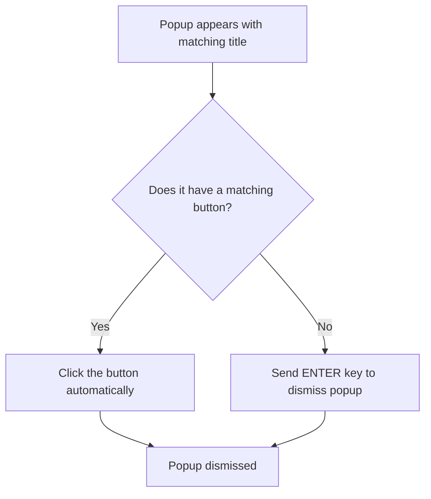

# Popup Clicker

Popup Clicker is a small Windows utility written in Go that automatically detects and dismisses specific pop-up windows by clicking their buttons or sending keystrokes.  
It is useful for automated environments where recurring dialog boxes interrupt workflows.

## Features

- Monitors creation and foreground changes of windows
- Matches windows by their title (case-insensitive)
- Finds and clicks a button by text (case-insensitive, ignores `&` accelerators)
- Falls back to sending **Enter** key if no button match is found
- Configurable via `popup_clicker.ini`
- Runs silently in the background until stopped

## Use Case Diagram



## Installation

1. Ensure you have [Go](https://golang.org/dl/) **1.24.5+** installed.
2. Clone this repository:

   ```sh
   git clone https://github.com/antoine-marchal/PopupClicker.git
   cd popup_clicker
   ```

3. Generate Windows resources (icon + manifest):

   ```sh
   goversioninfo -icon app.ico -manifest popup_clicker.exe.manifest
   ```

4. Build the binary:

   ```sh
   go build -o popup_clicker.exe
   ```

## Configuration

The application reads settings from `popup_clicker.ini`. Example:

```ini
[popup]
targetTitle=Warning
buttonText=OK
```

- **targetTitle**: Window title to match (default: `Warning`)  
- **buttonText**: Button label to click (default: `OK`)  

Quotes (`"..."` or `'...'`) are allowed. Keys are case-insensitive.

## Usage

Simply run the executable:

```sh
popup_clicker.exe
```

The program installs Windows event hooks and waits for matching pop-ups.  
Logs are printed to the console (useful for debugging).

Stop with **Ctrl+C**.

## Development Notes

- Resource metadata is generated with [`goversioninfo`](https://github.com/josephspurrier/goversioninfo).  
- Uses [`github.com/lxn/win`](https://pkg.go.dev/github.com/lxn/win) for Windows API bindings.  
- Created by Antoine Marchal.

## License

MIT License

